# 🎫 Ticket Booking System

A full-stack web application for booking movie tickets with user authentication, seat selection, and payment processing.

## ✨ Features

- **User Authentication**: Register, login, and logout functionality
- **Movie Shows**: Browse available movie shows with details
- **Seat Booking**: Interactive seat selection with real-time availability
- **Payment Integration**: UPI QR code payment with manual confirmation
- **Booking Management**: View and manage your bookings
- **Receipts**: Generate and view booking receipts
- **Responsive Design**: Modern UI that works on all devices

## 🛠️ Tech Stack

### Frontend
- **React 19** - Modern React with hooks
- **Vite** - Fast build tool and dev server
- **React Router DOM** - Client-side routing
- **Axios** - HTTP client for API calls
- **React QR Code** - QR code generation for payments
- **CSS3** - Modern styling with responsive design

### Backend
- **Node.js** - JavaScript runtime
- **Express.js** - Web framework
- **MongoDB** - NoSQL database
- **Mongoose** - MongoDB object modeling
- **JWT** - JSON Web Tokens for authentication
- **bcryptjs** - Password hashing
- **CORS** - Cross-origin resource sharing

## 🏗️ System Architecture

```mermaid
graph TB
    subgraph "Client Layer"
        User[👤 User]
        Browser[🌐 Browser]
        React[⚛️ React App]
        Router[🛣️ React Router]
        Context[🔧 Auth Context]
    end

    subgraph "Frontend Components"
        Pages[📄 Pages]
        Components[🧩 Components]
        Services[🔌 API Services]
        Styles[🎨 CSS Styles]
    end

    subgraph "API Gateway"
        CORS[CORS Middleware]
        Auth[Auth Middleware]
    end

    subgraph "Backend Layer"
        Express[🚀 Express Server]
        Controllers[🎮 Controllers]
        Routes[🛤️ API Routes]
        Middleware[🔒 Middleware]
    end

    subgraph "Database Layer"
        MongoDB[(🗄️ MongoDB)]
        Models[📊 Mongoose Models]
    end

    subgraph "External Services"
        UPI[💳 UPI Payment]
        QR[📱 QR Code Generator]
    end

    %% User interactions
    User --> Browser
    Browser --> React
    React --> Router
    React --> Context

    %% Frontend internal connections
    Router --> Pages
    Pages --> Components
    Components --> Services
    React --> Styles

    %% API communication
    Services --> CORS
    CORS --> Auth
    Auth --> Express

    %% Backend internal connections
    Express --> Routes
    Routes --> Controllers
    Controllers --> Middleware

    %% Database connections
    Controllers --> Models
    Models --> MongoDB

    %% External service connections
    Controllers --> UPI
    Controllers --> QR

    %% Data flow
    User -.->|HTTP Requests| Services
    Services -.->|JSON Responses| React
    React -.->|UI Updates| User

    %% Styling
    classDef clientLayer fill:#e1f5fe,stroke:#01579b,stroke-width:2px
    classDef frontendLayer fill:#f3e5f5,stroke:#4a148c,stroke-width:2px
    classDef apiLayer fill:#fff3e0,stroke:#e65100,stroke-width:2px
    classDef backendLayer fill:#e8f5e8,stroke:#1b5e20,stroke-width:2px
    classDef databaseLayer fill:#fce4ec,stroke:#880e4f,stroke-width:2px
    classDef externalLayer fill:#f1f8e9,stroke:#33691e,stroke-width:2px

    class User,Browser,React,Router,Context clientLayer
    class Pages,Components,Services,Styles frontendLayer
    class CORS,Auth apiLayer
    class Express,Controllers,Routes,Middleware backendLayer
    class MongoDB,Models databaseLayer
    class UPI,QR externalLayer
```



### Architecture Overview

**Client Layer:**
- **User Interface**: React-based SPA with modern UI/UX
- **State Management**: React Context for authentication state
- **Routing**: Client-side routing with React Router
- **API Communication**: Axios for HTTP requests

**API Gateway:**
- **CORS**: Handles cross-origin requests
- **Authentication**: JWT token validation middleware

**Backend Layer:**
- **Express Server**: RESTful API endpoints
- **Controllers**: Business logic and request handling
- **Routes**: API route definitions
- **Middleware**: Request processing and validation

**Database Layer:**
- **MongoDB**: NoSQL database for data persistence
- **Mongoose Models**: Data schema and validation

**External Services:**
- **UPI Payment**: Payment processing via QR codes
- **QR Generation**: Dynamic QR code creation for payments

### Data Flow

1. **User Authentication**: User registers/logs in → JWT token generated → Stored in React Context
2. **Show Browsing**: Frontend fetches shows from API → Displays in UI
3. **Seat Booking**: User selects seats → Booking created in database → Confirmation sent
4. **Payment Process**: QR code generated → User scans and pays → Manual confirmation → Receipt generated
5. **Booking Management**: User views bookings/receipts → Data fetched from database → Displayed in UI

## 📁 Project Structure

```
Ticket-Booking/
├── client/                 # React frontend
│   ├── src/
│   │   ├── components/     # Reusable components
│   │   ├── pages/         # Page components
│   │   ├── context/       # React context
│   │   ├── services/      # API services
│   │   └── styles/        # Global styles
│   └── public/            # Static assets
└── server/                # Node.js backend
    ├── controllers/       # Route controllers
    ├── models/           # MongoDB models
    ├── routes/           # API routes
    ├── middleware/       # Custom middleware
    └── config/           # Configuration files
```

## 🚀 Installation

### Prerequisites
- Node.js (v16 or higher)
- MongoDB (local or cloud instance)
- npm or yarn package manager

### Backend Setup

1. **Clone the repository**
   ```bash
   git clone <repository-url>
   cd Ticket-Booking
   ```

2. **Install server dependencies**
   ```bash
   cd server
   npm install
   ```

3. **Environment Configuration**
   Create a `.env` file in the server directory:
   ```env
   MONGO_URI=mongodb://localhost:27017/ticket-booking
   JWT_SECRET=your_jwt_secret_key
   PORT=5050
   ```

4. **Start the server**
   ```bash
   npm start
   # or for development with nodemon
   npx nodemon index.js
   ```

### Frontend Setup

1. **Install client dependencies**
   ```bash
   cd client
   npm install
   ```

2. **Start the development server**
   ```bash
   npm run dev
   ```

The application will be available at:
- Frontend: http://localhost:5173
- Backend API: http://localhost:5050

## 📖 Usage

### For Users

1. **Registration/Login**: Create an account or login with existing credentials
2. **Browse Shows**: View available movie shows on the home page
3. **Select Show**: Click on a show to view details and book tickets
4. **Choose Seats**: Select your preferred seats from the interactive seat map
5. **Payment**: Complete payment using the UPI QR code
6. **Confirmation**: Receive booking confirmation and receipt

### For Developers

#### API Endpoints

**Authentication**
- `POST /api/auth/register` - User registration
- `POST /api/auth/login` - User login
- `GET /api/auth/me` - Get current user (protected)

**Shows**
- `GET /api/shows` - Get all shows
- `GET /api/shows/:id` - Get show by ID

**Bookings**
- `POST /api/bookings` - Create new booking
- `GET /api/bookings/user/:userId` - Get user's bookings
- `GET /api/bookings/:id` - Get booking by ID

**Receipts**
- `POST /api/receipts` - Generate receipt
- `GET /api/receipts/user/:userId` - Get user's receipts

## 🔧 Development

### Available Scripts

**Frontend (client/)**
```bash
npm run dev      # Start development server
npm run build    # Build for production
npm run preview  # Preview production build
npm run lint     # Run ESLint
```

**Backend (server/)**
```bash
npm start        # Start production server
npx nodemon      # Start development server with auto-reload
```

### Database Models

- **User**: User authentication and profile data
- **Show**: Movie show information and scheduling
- **Booking**: Ticket booking details and seat information
- **Receipt**: Payment receipts and confirmation data

## 🎨 Features in Detail

### Authentication System
- Secure user registration with password hashing
- JWT-based authentication
- Protected routes and API endpoints

### Seat Booking System
- Interactive seat map with real-time availability
- Seat selection with visual feedback
- Booking confirmation with unique booking IDs

### Payment System
- UPI QR code generation for payments
- Manual payment confirmation
- Receipt generation after successful payment

### Responsive Design
- Mobile-first approach
- Modern UI with smooth animations
- Cross-browser compatibility

## 🔒 Security Features

- Password hashing with bcryptjs
- JWT token authentication
- CORS configuration
- Input validation and sanitization
- Protected API endpoints

## 🚀 Deployment

### Frontend Deployment
```bash
cd client
npm run build
# Deploy the dist/ folder to your hosting service
```

### Backend Deployment
```bash
cd server
# Set up environment variables on your hosting platform
# Deploy to services like Heroku, Railway, or DigitalOcean
```

## 🤝 Contributing

1. Fork the repository
2. Create a feature branch (`git checkout -b feature/amazing-feature`)
3. Commit your changes (`git commit -m 'Add some amazing feature'`)
4. Push to the branch (`git push origin feature/amazing-feature`)
5. Open a Pull Request

## 📝 License

This project is licensed under the ISC License.

## 👨‍💻 Author

**Sameer Gediya**
- GitHub: [@sameergediya](https://github.com/sameergediya)

## 🙏 Acknowledgments

- React team for the amazing framework
- MongoDB for the database solution
- Express.js community for the web framework
- All contributors and supporters

---

**Note**: This is a learning project. For production use, additional security measures, error handling, and testing should be implemented. 